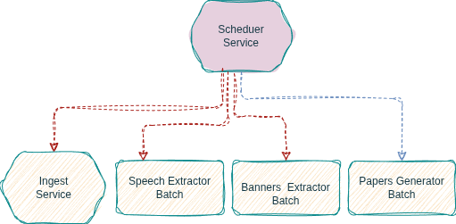
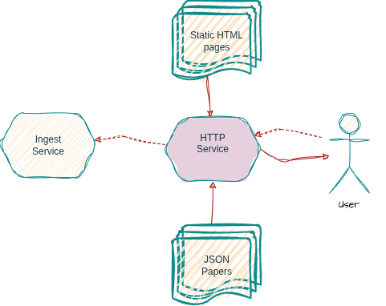

.. rubric:: ``cablewatch``
  :class: title-primary

.. rubric:: Base documentaire construite |br| à partir du *live* d'une chaîne d'info
  :class: title-secondary

.. rubric:: Sébastien MATZ |br| *2 Février 2026* |br| https://github.com/loghaan2/cablewatch
  :class: title-fields

|pgbr|

.. sectnum::
   :depth: 3

Introduction
============

Description de l'objectif
~~~~~~~~~~~~~~~~~~~~~~~~~

L'objectif du projet ``cablewatch`` est d'inspecter le *live* d'une chaîne d'information
française et de générer des fichiers structurés décrivant chaque émission. La génération
des documents se fait de manière continue, en suivant le direct. Par la suite, on peut
imaginer effectuer de la recherche documentaire sur ces fichiers à l'aide d'un *chatbot*
en utilisant des technologies telles que ``LLM`` et ``RAG``. Le système pourrait répondre
à des questions du type:

  - *Quel était le sujet majeur dans l'actualité du 2 février 2026 ?*
  - *Qui était l'invité de l'émission "La Matinale" aujourd'hui ?*

Dans la suite de ce rapport, nous nous concentrerons uniquement sur la première phase, à savoir
la génération de documents et présenterons l'implémentation qui a été mise en œuvre. Les
documents générés, ou *papers* comme on les appellera par la suite, sont construits à l'aide
de la transcription audio de l'émission et des bandeaux apparaissant à l'image, contenant
des méta-informations comme le titre de l'émission, le sujet traité et le nom de l'intervenant
qui prend la parole.

Utilité
~~~~~~~

Ce projet a trouvé son inspiration suite à un article [1]_ de Reporters Sans Frontières sur le pluralisme
des médias en France publié le 26 novembre 2025. ``RSF`` a analysé près de 700 000 bandeaux d’information
capturés automatiquement entre le 1er et le 31 mars 2025, sur les quatre grandes chaînes d’information
en continu en France (``BFMTV``, ``CNews``, ``France Info``, ``LCI``) afin d’évaluer le respect du pluralisme
politique à l’antenne. À noter que le système mis en place par ``RSF`` analyse uniquement les bandeaux,
alors que ``cablewatch`` a l'ambition d'utiliser également la transcription audio.

On peut donc aisément imaginer que des projets similaires peuvent être utiles au milieu
journalistique ou à un organisme étatique comme l'``ARCOM``, chargé de réguler et de garantir
le respect des médias audiovisuels et des plateformes numériques en France.

|br| |br| |br| |br| |br| |br| |br| |br|

.. [1] Pluralisme en France: sur CNews, le grand contournement |br|
    https://rsf.org/fr/pluralisme-en-france-sur-cnews-le-grand-contournement-vid%C3%A9o

|pgbr|

Cadre technique
~~~~~~~~~~~~~~~

En résumé, ``cablewatch`` permet de construire une base documentaire à partir du direct d'une
chaîne d'information. Le choix de la chaîne s'est porté arbitrairement sur ``France Info``. La source
de données est la plateforme ``YouTube``, qui héberge le *stream* de ``France Info`` accessible
à cette adresse [2]_. Les documents, ou *papers*, sont des fichiers ``.json`` et un *paper* est généré
pour chaque émission de la journée.

|br|

.. image:: _static/images/overview.png
  :class: overview

|br|

.. table-overview

.. list-table::
  :header-rows: 1

  * - Côté source
    - Côté utilisateur
  * - ``cablewatch`` enregistre le stream de la chaîne d’actualité et analyse la vidéo enregistrée
      pour en extraire des données. Ceci s'effectue de manière continue et la base documentaire
      est construite au fur et à mesure.
    - Via une interface web, ``cablewatch`` donne accès à l'utilisateur à la base documentaire.
      Ici il peut effectuer une recherche simpliste en fonction de la date et du nom de l'émission.
      Il peut également télécharger des *papers* ou un ensemble de *papers* sous la forme d'une
      archive ``.tar.gz``.

.. /table-overview

|br| |br| |br| |br| |br| |br| |br| |br| |br| |br| |br| |br| |br| |br|

.. [2] franceinfo - DIRECT TV |br|
    actualité France et monde, interviews, documentaires et analyses |br|
    https://www.youtube.com/watch?v=Z-Nwo-ypKtM

|pgbr|

"Compétences" à valider pour la certification
=============================================

Pour la bonne tenue de ce rapport on rappelle ici la liste des compétences à valider
pour la certification ``Développeur en intelligence artificielle - Simplon RNCP37827BC01``.

*Réaliser la collecte, le stockage et la mise à disposition des données d’un projet en intelligence artificielle*

Ci-dessous on a crée des liens vers le contenu du rapport qui couvrent les compétences requises:

.. [C1] Collecter les données de manière automatisée.

.. [C2] Préparer les données pour leur première utilisation.

.. [C3] Mettre en œuvre des règles d’agrégation de données.

.. [C4] Créer une base de données.

.. [C5] Mettre à disposition les données via une API.

|pgbr|

Architecture logicel
====================

*Data flow*
~~~~~~~~~~~

Le système ``cablewatch`` comprend plusieurs composants logiciels. Ci-dessous un schéma
orienté *data flow* qui présente ces différents composants ainsi que les liens qui les
unissent:

.. image:: _static/images/architecture.png
  :class: architecture

La flèche continue rouge |data_arrow| montre le chemin des données depuis le *stream* ``youtube`` jusqu'à
l'utilisateur. Ces données traversent plusieurs composants logiciels qui peuvent être également vus comme
des *process* (au sens *operating system* du terme). On distingue deux types de *process*:

    - les services |service| qui tournent en continu sur la machine hôte (``ingest``, ``scheduler`` et ``HTTP``)
    - les *batchs* |batch| qui sont lancés ponctuellement (par le *scheduler* ou à la main par l'administrateur) et qui se terminent.

Les interactions de contrôle sont symbolisées par des flèches rouges en pointillé |control_arrow|. Il s'agit
surtout de requêtes ordonnées par le *scheduler* ou l'utilisateur. À noter également la flèche en pointillé mauve
qui représente un ordre de lancement mais qui n'est pas encore implémenté à l'heure où ces lignes sont écrites.

Enfin, le flux de données peut être "interrompu". Les données sont alors stockées (temporairement ou non) dans
le système de fichiers, symbolisé par |filesystem| dans le schéma pour être traitées ultérieurement.

Technologies "majeures"
~~~~~~~~~~~~~~~~~~~~~~~

Le langage de programation du projet est le ``python`` mais il utilise aussi largement ``ffmpeg`` pour le traitement
vidéo dans au moins trois de ses composants logiciels. Nous profitons donc de cette section pour en faire une brève
présentation.

``ffmpeg`` est un logiciel libre en ligne de commande dédié au traitement audio et vidéo. Il permet
notamment de convertir des formats, de compresser des médias, d’extraire l’audio, de découper des vidéos, d’ajouter
des sous-titres ou encore de diffuser en *streaming*. Très puissant et rapide, il est largement utilisé en arrière-plan
par de nombreux lecteurs, éditeurs vidéo et plateformes multimédias. Plus spécifiquement, le projet s’appuie sur ``ffmpeg``
et l’utilisation de *pipes* pour chaîner les traitements directement en mémoire côté ``python``. Cette approche
améliore les performances et réduit les accès disque en supprimant le besoin de fichiers intermédiaires.

*Mindset / Spirit*
~~~~~~~~~~~~~~~~~~~

La philosophie de ce projet est de mener le projet de bout en bout, même si à la fin il comporte des imperfections. Pour cette
raison, il a été décidé de choisir une infrastructure plutôt *light*. C'est-à-dire que l'architecture présentée
dans la section précédente est destinée à "tourner" sur une seule machine. Nous verrons plus tard que ceci n'est pas tout
à fait vrai et que le composant ``speech`` utilise un service extérieur. Néanmoins, cette architecture *light* a permis
de démarrer le développement rapidement et d'avoir un cycle itératif **Build-->Run-->Debug-->Fix** assez court.
Par exemple, au lieu d'utiliser un gros *framework* d'orchestration comme ``airflow``, on a privilégié une petite *library*
``Python``, ``apscheduler``, qui est amplement suffisante pour la taille du projet. Enfin, les trois services mentionnés
ci-dessus (``ingest``, ``scheduler`` et ``http``) sont regroupés au sein d'un même super service. Ceci est rendu
possible grâce à l'utilisation de ces petites bibliothèques et du module standard ``python`` ``asyncio``.

|pgbr|

Composant ``cablewatch.ingest``
===============================

.. image:: _static/images/ingest.png
  :class: ingest

Service [C1]_
~~~~~~~~~~~~~~

Le but du service d'``ingest`` est d'enregistrer le *stream* sur le *filesystem*. Comme souvent en traitement vidéo, on découpe
le *stream* en plusieurs fichiers de petite taille (dans notre cas ici, une durée de ``30s``) appelés des segments. Si une corruption
ou micro-coupure réseau se produit, seuls les segments affectés sont perdus, pas toute la vidéo. Le service repose essentiellement
sur deux technologies: ``yt-dlp`` et ``ffmpeg``. Le premier permet de se connecter à la plateforme ``YouTube`` et de récupérer
une vidéo (*live* ou non) à partir d'une URL type ``https://www.youtube.com/watch?v=xxxxxxxx``. Le programme peut enregistrer
directement la vidéo sur le système de fichiers ou la passer à un autre programme via sa sortie standard (``stdout``), dans notre
cas ``ffmpeg``. Ce dernier va alors faire le découpage en segments et récupérer l'horodatage du *stream*, qui va nous servir par
la suite. L'horodatage est inscrit dans le nom de fichier du segment.

Tout ceci est contrôlé par un *process* père écrit en ``Python`` qui inspecte la sortie d'erreur des programmes
et vérifie que "tout se passe bien". En cas de soucis (coupure réseau, arrêt du *stream* côté ``YouTube`` ou autre), le *process*
père peut redémarrer automatiquement les *process* fils (``yt-dlp | ffmpeg``). En cas d'arrêt de l'enregistrement, il y a
une discontinuité dans la vidéo. Une autre mission de ce module est de marquer cette discontinuité.

Le service fournit également une API web interne permettant de *monitorer* le service (*uptime*, *filename* du segment
en cours, ``PID``, ...). Cette API permet également d'arrêter et de redémarrer l'enregistrement. L'API web est documentée
dans les annexes dans la section `Annexe B - Ingest WEB API`_. Il y également un exemple d'utilisation dans le ``README.rst`` à
la section `Control / monitor the service via the web API`_.

Pour démarrer le service, comme tous les autres service, il faut lancer le programmer ``cablewatch-super``:

.. code-block:: shell-session

    $ cablewatch-super
    20260201_11h01m27 INFO cablewatch.super args: []
    (...)
    20260201_11h01m27 INFO cablewatch.ingest starting ingest service
    (...)

Voilà à quoi peut ressembler le dossier où sont stockés les segments après quelques minutes d'enregistrement:

.. code-block:: shell-session

    $ ls data/ingest
    segment_20260128_16h53m07_30000ms.ts     segment_20260128_16h58m05_30000ms.ts
    segment_20260128_16h53m36_30000ms.ts     segment_20260128_16h58m36_30000ms.ts
    segment_20260128_16h54m06_30000ms.ts     segment_20260128_16h59m06_30000ms.ts
    segment_20260128_16h54m36_30000ms.ts     segment_20260128_16h59m36_30000ms.ts
    segment_20260128_16h55m07_30000ms.ts     segment_20260128_17h00m06_30000ms.ts
    segment_20260128_16h55m36_30000ms.ts     segment_20260128_17h00m06_30000ms.ts.discont-after
    segment_20260128_16h56m07_30000ms.ts     segment_20260128_17h02m07_30000ms.ts
    segment_20260128_16h56m36_30000ms.ts     segment_20260128_17h02m36_30000ms.ts
    segment_20260128_16h57m07_30000ms.ts     segment_20260128_17h03m06_30000ms.ts
    segment_20260128_16h57m37_30000ms.ts     segment_20260128_17h03m36_30000ms.ts

Ici, on note que l'enregistrement a débuté à ``16h53``. Il y a eu un arrêt à ``17h00`` et la discontinuité a été marquée. Reprise
de l'enregistrement à ``17h02``.

Slices & Timelines
~~~~~~~~~~~~~~~~~~

Le composant fournit également une interface de programmation destinée aux autres modules afin qu'ils puissent correctement
parcourir les segments. On introduit donc ici deux notions:

  - le ``slice`` qui symbolise une portion de la vidéo (sans discontinuité) avec une date de début et une date de fin. Il
    peut également être vu comme une séquence de ``segments``. À partir d'un ``slice``, on peut générer une commande ``ffmpeg``
    qui prend en entrée l'ensemble des segments de ce ``slice``.

  - la ``timeline`` qui symbolise une portion de la vidéo possiblement avec discontinuité, ou autrement dit avec des "trous".
    Elle possède toujours une date de début et une date de fin. Elle peut également être vue comme une séquence de ``slices``. On
    peut également la voir comme une sorte de fenêtre temporelle d'une durée fixe, qui peut être déplacée et sur laquelle un
    batch va s'appliquer. Chaque *process* de ``batch`` aura donc une ``timeline`` qui lui est propre.

Ci-dessous un diagramme d'objets qui est une photo à un instant donné du système. Il montre les instances des objets présentés, leurs
valeurs d’attributs et les liens entre eux:

.. image:: _static/images/ingest_obj_diagram.png
  :class: ingest-obj-diagram

|pgbr|

Sur ce dernier schéma, on voit parfaitement les segments actuellement utilisés (de ``#3`` à ``#10``) et les segments qui vont
l'être (``#11 et #12``). À priori, les segments ``#1`` et ``#2`` ne sont plus utiles.

Pendant que le service d'ingest fait son travail, il est possible d'afficher la liste des ``timelines`` grâce à la commande
ci-dessous:

.. code-block:: shell-session
  :class: small-font

    $ cablewatch-ingest list
    ┏━━━━━━━━━┳━━━━━━━━━━━━━━━━━━━┳━━━━━━━━━━━━━━━━━━━┳━━━━━━━━━━━━━━━━┳━━━━━━━━━━━━━━━━━━━━┳━━━━━━━━━━━━━━┳━━━━━━━━━━━━━━━━━━━━━┓
    ┃ NAME    ┃ BEGIN             ┃ END               ┃ DURATION       ┃ EFFECTIVE_DURATION ┃ NUM_SEGMENTS ┃ NUM_DISCONTINUITIES ┃
    ┡━━━━━━━━━╇━━━━━━━━━━━━━━━━━━━╇━━━━━━━━━━━━━━━━━━━╇━━━━━━━━━━━━━━━━╇━━━━━━━━━━━━━━━━━━━━╇━━━━━━━━━━━━━━╇━━━━━━━━━━━━━━━━━━━━━┩
    │ .all    │ 20260128_16h47m36 │ 20260129_19h14m29 │ 1 day, 2:26:53 │ 19:59:47           │ 2400         │ 4                   │
    │ banners │ 20260129_19h10m26 │ 20260129_19h25m26 │ 0:15:00        │ 0:04:04            │ 9            │ 0                   │
    │ speech  │ 20260129_19h04m50 │ 20260129_19h19m50 │ 0:15:00        │ 0:09:40            │ 20           │ 0                   │
    └─────────┴───────────────────┴───────────────────┴────────────────┴────────────────────┴──────────────┴─────────────────────┘

Au bout d'un moment, les ``timelines`` ``"speech"`` et ``"banners"`` ont "bougé":

.. code-block:: shell-session
  :class: small-font

    $ cablewatch-ingest list
    ┏━━━━━━━━━┳━━━━━━━━━━━━━━━━━━━┳━━━━━━━━━━━━━━━━━━━┳━━━━━━━━━━━━━━━━┳━━━━━━━━━━━━━━━━━━━━┳━━━━━━━━━━━━━━┳━━━━━━━━━━━━━━━━━━━━━┓
    ┃ NAME    ┃ BEGIN             ┃ END               ┃ DURATION       ┃ EFFECTIVE_DURATION ┃ NUM_SEGMENTS ┃ NUM_DISCONTINUITIES ┃
    ┡━━━━━━━━━╇━━━━━━━━━━━━━━━━━━━╇━━━━━━━━━━━━━━━━━━━╇━━━━━━━━━━━━━━━━╇━━━━━━━━━━━━━━━━━━━━╇━━━━━━━━━━━━━━╇━━━━━━━━━━━━━━━━━━━━━┩
    │ .all    │ 20260128_16h47m36 │ 20260129_19h30m01 │ 1 day, 2:42:25 │ 20:15:17           │ 2431         │ 4                   │
    │ banners │ 20260129_19h25m26 │ 20260129_19h40m26 │ 0:15:00        │ 0:04:35            │ 10           │ 0                   │
    │ speech  │ 20260129_19h18m50 │ 20260129_19h33m50 │ 0:15:00        │ 0:11:10            │ 23           │ 0                   │
    └─────────┴───────────────────┴───────────────────┴────────────────┴────────────────────┴──────────────┴─────────────────────┘

À noter l'existence de la ``timeline`` ``".all"``, qui est spéciale et contient toujours l'ensemble des segments enregistrés.

|pgbr|

Composant ``cablewatch.banners``
================================

.. image:: _static/images/banners.png
  :class: banners

Le composant logiciel ``banners`` permet d’extraire certaines méta-informations présentes dans l’image de la vidéo,
telles que le titre de l’émission, le sujet traité ou le locuteur. Voici à quoi ressemblent ces bandeaux:

.. image:: _static/images/franceinfo_frame_with_arrows.png
  :class: franceinfo

À noter que sur cette *frame* figure un quatrième bandeau. Il s’agit de brèves d’actualité, de type dépêche ``AFP``,
généralement sans rapport avec le contenu de la vidéo. Ce bandeau n’est donc pas pris en compte.
Voici comment lancer l’opération « à la main »:

.. code-block:: shell-session
  :class: small-font

    $ cablewatch-banners init -Tb 20260130_17h00m00 -Td 15mn
    $ cablewatch-ingest list
    ┏━━━━━━━━━┳━━━━━━━━━━━━━━━━━━━┳━━━━━━━━━━━━━━━━━━━┳━━━━━━━━━━┳━━━━━━━━━━━━━━━━━━━━┳━━━━━━━━━━━━━━┳━━━━━━━━━━━━━━━━━━━━━┓
    ┃ NAME    ┃ BEGIN             ┃ END               ┃ DURATION ┃ EFFECTIVE_DURATION ┃ NUM_SEGMENTS ┃ NUM_DISCONTINUITIES ┃
    ┡━━━━━━━━━╇━━━━━━━━━━━━━━━━━━━╇━━━━━━━━━━━━━━━━━━━╇━━━━━━━━━━╇━━━━━━━━━━━━━━━━━━━━╇━━━━━━━━━━━━━━╇━━━━━━━━━━━━━━━━━━━━━┩
    │ .all    │ 20260130_17h00m00 │ 20260130_20h30m00 │ 3:30:00  │ 3:30:00            │ 420          │ 0                   │
    │ banners │ 20260130_17h00m00 │ 20260130_17h15m00 │ 0:15:00  │ 0:15:00            │  30          │ 0                   │
    └─────────┴───────────────────┴───────────────────┴──────────┴────────────────────┴──────────────┴─────────────────────┘

La *timeline* ``banners`` a été créée (ou réinitialisée) afin d’extraire les métadonnées contenues dans les bandeaux
présents dans les segments d’ingest entre ``17h00`` et ``17h15`` le 30 janvier 2026.
Pour lancer l’extraction sur cette *timeline*, on exécute la commande suivante:

.. code-block:: shell-session
  :class: small-font

    $ cablewatch-banners extract
    20260130_17h38m56 INFO cablewatch.banners timeline before: 'banners' begin='20260130_17h00m00' duration=900.0
    20260130_17h38m56 INFO cablewatch.banners detect banners of kind 'topic'...
    20260130_17h38m56 INFO cablewatch.banners run 'ffmpeg -i /home/loghaan/cablewatch/data/ingest/segment_20260130_17h00m00_30000ms.ts ...
    20260130_17h38m58 INFO cablewatch.banners banner frame 'topic' detected at {'duration': 3.1, 'end': 108.1, 'start': 166.666667}s
    (...)
    $ cablewatch-ingest list
    ┏━━━━━━━━━┳━━━━━━━━━━━━━━━━━━━┳━━━━━━━━━━━━━━━━━━━┳━━━━━━━━━━┳━━━━━━━━━━━━━━━━━━━━┳━━━━━━━━━━━━━━┳━━━━━━━━━━━━━━━━━━━━━┓
    ┃ NAME    ┃ BEGIN             ┃ END               ┃ DURATION ┃ EFFECTIVE_DURATION ┃ NUM_SEGMENTS ┃ NUM_DISCONTINUITIES ┃
    ┡━━━━━━━━━╇━━━━━━━━━━━━━━━━━━━╇━━━━━━━━━━━━━━━━━━━╇━━━━━━━━━━╇━━━━━━━━━━━━━━━━━━━━╇━━━━━━━━━━━━━━╇━━━━━━━━━━━━━━━━━━━━━┩
    │ .all    │ 20260130_17h00m00 │ 20260130_20h30m00 │ 3:30:00  │ 3:30:00            │ 420          │ 0                   │
    │ banners │ 20260130_17h15m00 │ 20260130_17h30m00 │ 0:15:00  │ 0:15:00            │  30          │ 0                   │
    └─────────┴───────────────────┴───────────────────┴──────────┴────────────────────┴──────────────┴─────────────────────┘

|br|

A noter que si il n'y pas assez de segments dans la *timeline* ou dit autrement si ``EFFECTIVE_DURATION < DURATION``,
le traitement ne s'effectue pas.

À l’issue du traitement, un fichier ``data/banners/20260130_17h00m00_900000ms.json`` est généré et contient les données
extraites. On observe également que la *timeline* s’est déplacée de 15 minutes vers le futur.

Pour le traitement, ce composant logiciel repose sur les technologies suivantes: ``tesseract`` (OCR), ``PIL``
(manipulation d’images) et ``ffmpeg``. Le principe général consiste à détecter les zones figées de la vidéo
correspondant à la position de chaque type de bandeau. Pour cela, les filtres ``freezedetect`` et ``crop``
de ``ffmpeg`` sont nos amis.

À l’issue de cette étape, on obtient pour chaque type de bandeau un *timestamp* indiquant l’instant où la vidéo
recadrée (*cropped*) est figée (*freezed*). À partir de ces informations, une image est extraite pour chaque couple
(*timestamp*, type de bandeau) . Pour chaque image ou *frame* on vérifie que la couleur du *background* est celle
attendue:

- blanc pour le locuteur (*speaker*)
- noir pour le sujet (*topic*)
- jaune pour le titre de l’émission

Chaque image est ensuite traitée par ``tesseract`` afin d’extraire le contenu textuel du bandeau sous forme de chaîne
de caractères. À la fin de l’opération, les données sont stockées dans un fichier ``.json`` [C2]_ comme mentionné
précédemment. Au fur et à mesure des extractions, ces fichiers s’accumulent.
Voici à quoi peut ressembler le répertoire de stockage:

|br|

.. code-block:: shell-session

    $ ls data/banners
    20260130_16h47m36_810000ms.json         20260130_19h02m06_810000ms.json
    20260130_17h02m07_811000ms.json         20260130_19h17m06_810000ms.json
    20260130_17h17m06_810000ms.json         20260130_19h32m06_810000ms.json
    20260130_17h32m06_810000ms.json         20260130_19h47m35_869000ms.json
    20260130_17h47m06_810000ms.json         20260130_20h02m06_810000ms.json
    20260130_18h02m06_810000ms.json         20260130_20h17m06_810000ms.json
    20260130_18h17m06_810000ms.json         20260130_20h32m06_810000ms.json
    20260130_18h32m06_810000ms.json         20260130_20h47m06_810000ms.json
    20260130_18h47m06_810000ms.json         20260130_21h02m06_810000ms.json

Finalement, le module fournit une interface en ligne de commande ainsi qu’une interface de programmation permettant
d’itérer sur ces données et de les manipuler comme si elles provenaient d’une table (au sens base de données). Le
module propose également deux niveaux (ou couches) de données: ``bronze`` et ``silver``.

|pgbr|

Ci-dessous, le schéma de la table [C4]_:

.. banners-table

================ ================= =====================================================================================
 Champs           Type               Description
================ ================= =====================================================================================
 ``kind``         ``str``            Type de bandeau: ``"speaker"``, ``"topic"`` ou ``"programtitle"``
 ``begin``        ``datetime``       Instant dans la vidéo où le bandeau apparaît
 ``duration``     ``float``          Durée d’affichage du bandeau
 ``content``      ``str``            Contenu textuel du bandeau
================ ================= =====================================================================================

.. /banners-table

Visualisation en ligne de commande (niveau ``bronze``):

.. code-block:: shell-session
    :class: small-font

    $ cablewatch-banners bronze -Tb yesterday -Td 24h
    (...)
    {'kind': 'speaker', 'begin': '20260130_07h00m09', 'duration': 3.833333, 'content': 'Julia Van Aelst\n'}
    {'kind': 'topic', 'begin': '20260130_07h00m14', 'duration': 4.866667, 'content': 'Narcotrafic : E. Macron lance le "plan douanes massif"\n'}
    {'kind': 'topic', 'begin': '20260130_07h00m19', 'duration': 6.2, 'content': 'Narcotrafic : E. Macron lance le "plan douanes massif"\n'}
    {'kind': 'programtitle', 'begin': '20260130_07h00m39', 'duration': 12.666667, 'content': 'La matinale\n'}
    (...)

Visualisation en ligne de commande (niveau ``silver``):

.. code-block:: shell-session
    :class: small-font

    $ cablewatch-banners silver -Tb yesterday -Td 24h
    (...)
    {'kind': 'speaker', 'begin': '20260130_07h00m09', 'duration': 3.833333, 'content': 'Julia Van Aelst'}
    {'kind': 'topic', 'begin': '20260130_07h00m14', 'duration': 4.866667, 'content': 'Narcotrafic : E. Macron lance le "plan douanes massif"'}
    {'kind': 'topic', 'begin': '20260130_07h00m19', 'duration': 6.2, 'content': 'Narcotrafic : E. Macron lance le "plan douanes massif"'}
    {'kind': 'programtitle', 'begin': '20260130_07h00m39', 'duration': 12.666667, 'content': 'La matinale'}
    (...)

La différence entre les *layers* ``bronze`` et ``silver`` consiste en un nettoyage simple des données: remplacer
des caractères ``"\n"`` par des espaces dans le champ ``content`` et application de la fonction ``python`` ``str.strip()`` [C2]_.

Côté Python, on peut itérer sur les données de la façon suivante [C4]_:

.. code-block:: python
  :class: small-font

    from datetime import datetime, timedelta
    from cablewatch.banners import BannersQuery

    begin = datetime.now() - timedelta(hours=24)
    end = datetime.now()

    for row in BannersQuery(begin=begin, end=end, layer="silver"):
        print(row)  # row est un dictionnaire de la forme {'kind': ..., 'begin': ..., 'duration': ..., 'content': ...}

A titre indicatif sur une journée type d'enregistrement (de ``6h30`` à ``0h``) on a 1055 row(s) de type ``"speaker"``, 
519 row(s) de type ``"programtitle"`` et 1779 row(s) de type ``"topic"``.

.. code-block:: shell-session
  :class: small-font

  $ cablewatch-banners -Tb 20260129_0h00 -Td 24h|grep "'speaker'"|wc -l
  1055
  $ cablewatch-banners -Tb 20260129_0h00 -Td 24h|grep "'programtitle'"|wc -l
  591
  $ cablewatch-banners -Tb 20260129_0h00 -Td 24h|grep "'topic'"|wc -l
  1779

|pgbr|

Composant ``cablewatch.speech``
===============================

.. image:: _static/images/speech.png
  :class: speech

Le composant logiciel ``speech`` permet de réaliser la transcription de l’audio de la vidéo. Pour lancer
l’opération, il faut, comme pour le module ``banners``, d’abord initialiser ou créer la ``timeline``:

.. code-block:: shell-session
  :class: small-font

    $ cablewatch-speech init -Tb 20260131_09h00m00 -Td 15mn
    $ cablewatch-ingest list
    ┏━━━━━━━━━┳━━━━━━━━━━━━━━━━━━━┳━━━━━━━━━━━━━━━━━━━┳━━━━━━━━━━┳━━━━━━━━━━━━━━━━━━━━┳━━━━━━━━━━━━━━┳━━━━━━━━━━━━━━━━━━━━━┓
    ┃ NAME    ┃ BEGIN             ┃ END               ┃ DURATION ┃ EFFECTIVE_DURATION ┃ NUM_SEGMENTS ┃ NUM_DISCONTINUITIES ┃
    ┡━━━━━━━━━╇━━━━━━━━━━━━━━━━━━━╇━━━━━━━━━━━━━━━━━━━╇━━━━━━━━━━╇━━━━━━━━━━━━━━━━━━━━╇━━━━━━━━━━━━━━╇━━━━━━━━━━━━━━━━━━━━━┩
    │ .all    │ 20260131_09h00m00 │ 20260131_10h30m00 │ 1:30:00  │ 0:30:00            │ 180          │ 0                   │
    │ speech  │ 20260131_09h00m00 │ 20260131_09h15m00 │ 0:15:00  │ 0:15:00            │  30          │ 0                   │
    └─────────┴───────────────────┴───────────────────┴──────────┴────────────────────┴──────────────┴─────────────────────┘

Ici, la *timeline* ``speech`` a été créée (ou réinitialisée) afin d’effectuer la transcription de l’audio des segments
d’ingest compris entre ``9h00`` et ``9h15`` le 31 janvier 2026. L’opération repose sur le service
``speech_v2`` (*mode batch*) de ``Google Cloud`` et se déroule en trois étapes.

Conversion et *upload*
~~~~~~~~~~~~~~~~~~~~~~

Cette première étape consiste à convertir, à l’aide de ``ffmpeg``, la portion vidéo de la *timeline* au format
``.wav`` mono 16 bits / 16 kHz. Il s’agit du format audio recommandé par l’API ``speech_v2``.
Ce contenu ``.wav`` est alors *uploadé* dans un *bucket* dédié sous la forme d’un *blob*:

.. code-block:: shell-session
  :class: small-font

    $ cablewatch-speech upload
    (...)
    '20260131_09h43m21 INFO cablewatch.speech '20260131_09h00m00_900000ms.wav' uploaded
    (...)

On peut inspecter le contenu du *bucket* avec la commande ci-dessous. Si, avant l’opération d’*upload*, le *bucket*
était vide, on obtient alors le résultat suivant:

.. code-block:: shell-session
  :class: small-font

  $ cablewatch-speech list-bucket
  ┏━━━━━━━━━━━━━━━━━━━━━━━━━━━━━━━━━━━━━━━━━━━━━━━━━━━━━━━━━━┳━━━━━━━━━┳━━━━━━━━━┓
  ┃ NAME                                                     ┃  SIZE   ┃ CONTENT ┃
  ┡━━━━━━━━━━━━━━━━━━━━━━━━━━━━━━━━━━━━━━━━━━━━━━━━━━━━━━━━━━╇━━━━━━━━━╇━━━━━━━━━┩
  │ speech-extractor/                                        │         │         │
  │ speech-extractor/launched/                               │         │         │
  │ speech-extractor/results/                                │         │         │
  │ speech-extractor/uploaded/                               │         │         │
  │ speech-extractor/uploaded/20260131_09h00m00_900000ms.wav │     26M │ ?       │
  └──────────────────────────────────────────────────────────┴─────────┴─────────┘

À noter qu’à l’issue de l’opération, la *timeline* s’est déplacée comme attendu. On constate toutefois que le début
de la nouvelle *timeline* « rogne » de ``10s`` sur la fin de l’ancienne. Ce comportement (volontaire) sera expliqué plus loin.

.. code-block:: shell-session
  :class: small-font

    $ cablewatch-ingest list
    ┏━━━━━━━━━┳━━━━━━━━━━━━━━━━━━━┳━━━━━━━━━━━━━━━━━━━┳━━━━━━━━━━┳━━━━━━━━━━━━━━━━━━━━┳━━━━━━━━━━━━━━┳━━━━━━━━━━━━━━━━━━━━━┓
    ┃ NAME    ┃ BEGIN             ┃ END               ┃ DURATION ┃ EFFECTIVE_DURATION ┃ NUM_SEGMENTS ┃ NUM_DISCONTINUITIES ┃
    ┡━━━━━━━━━╇━━━━━━━━━━━━━━━━━━━╇━━━━━━━━━━━━━━━━━━━╇━━━━━━━━━━╇━━━━━━━━━━━━━━━━━━━━╇━━━━━━━━━━━━━━╇━━━━━━━━━━━━━━━━━━━━━┩
    │ .all    │ 20260131_09h00m00 │ 20260131_10h30m00 │ 1:30:00  │ 0:30:00            │ 180          │ 0                   │
    │ speech  │ 20260131_09h14m50 │ 20260131_09h19m50 │ 0:15:00  │ 0:15:00            │  30          │ 0                   │
    └─────────┴───────────────────┴───────────────────┴──────────┴────────────────────┴──────────────┴─────────────────────┘

Comme pour le module ``banners``, si il n’y a pas assez de segments dans la *timeline* — ou, dit autrement, si
``EFFECTIVE_DURATION < DURATION`` — le traitement ne s’effectue pas.

Lancement de la transcription
~~~~~~~~~~~~~~~~~~~~~~~~~~~~~

Pour lancer la transcription côté ``Google Cloud``, il faut utiliser la commande ci-dessous:

.. code-block:: shell-session
  :class: small-font

    $ cablewatch-ingest launch
    20260131_10h00m04 WARNING cablewatch.speech no enough wav blobs (5 needed) to start launching

Le lancement ne s’effectue pas si il n’y a pas au moins cinq fichiers ``.wav`` *uploadés* dans
le *bucket*. Il est donc nécessaire de répéter encore quatre fois l’opération précédente.

.. code-block:: shell-session
  :class: small-font

  $ cablewatch-speech upload
  (...)
  $ cablewatch-speech upload
  (...)
  $ cablewatch-speech upload
  (...)
  $ cablewatch-speech upload
  (...)
  $ cablewatch-speech list-bucket
  ┏━━━━━━━━━━━━━━━━━━━━━━━━━━━━━━━━━━━━━━━━━━━━━━━━━━━━━━━━━━━━━━━┳━━━━━━━━┳━━━━━━━━━━━━━┓
  ┃ NAME                                                          ┃   SIZE ┃ CONTENT     ┃
  ┡━━━━━━━━━━━━━━━━━━━━━━━━━━━━━━━━━━━━━━━━━━━━━━━━━━━━━━━━━━━━━━━╇━━━━━━━━╇━━━━━━━━━━━━━┩
  │ speech-extractor/                                             │        │             │
  │ speech-extractor/launched/                                    │        │             │
  │ speech-extractor/results/                                     │        │             │
  │ speech-extractor/uploaded/                                    │        │             │
  │ speech-extractor/uploaded/20260131_09h00m00_900000ms.wav      │    26M │ ?           │
  │ speech-extractor/uploaded/20260131_09h14m50_900000ms.wav      │    26M │ ?           │
  │ speech-extractor/uploaded/20260131_09h19m40_900000ms.wav      │    26M │ ?           │
  │ speech-extractor/uploaded/20260131_09h34m30_900000ms.wav      │    26M │ ?           │
  │ speech-extractor/uploaded/20260131_09h49m20_900000ms.wav      │    26M │ ?           │
  └───────────────────────────────────────────────────────────────┴────────┴─────────────┘
  $ cablewatch-ingest launch
  (...)
  20260131_09h54m57 INFO cablewatch.speech The following wav files will be processed under the operation
  20260131_09h54m57 INFO cablewatch.speech  'projects/85509047826/locations/eu/operations/v2-01234567-0000-1111-2222-3456789abcde':
  20260131_09h54m57 INFO cablewatch.speech   - gs://cablewatch-prod-bucket/speech-extractor/uploaded/20260131_09h00m00_900000ms.wav
  20260131_09h54m57 INFO cablewatch.speech   - gs://cablewatch-prod-bucket/speech-extractor/uploaded/20260131_09h14m50_900000ms.wav
  20260131_09h54m57 INFO cablewatch.speech   - gs://cablewatch-prod-bucket/speech-extractor/uploaded/20260131_09h19m40_900000ms.wav
  20260131_09h54m57 INFO cablewatch.speech   - gs://cablewatch-prod-bucket/speech-extractor/uploaded/20260131_09h34m30_900000ms.wav
  20260131_09h54m57 INFO cablewatch.speech   - gs://cablewatch-prod-bucket/speech-extractor/uploaded/20260131_09h49m20_900000ms.wav
  (...)
  $ cablewatch-speech list-bucket
  ┏━━━━━━━━━━━━━━━━━━━━━━━━━━━━━━━━━━━━━━━━━━━━━━━━━━━━━━━━━━━━━━━┳━━━━━━━━┳━━━━━━━━━━━━━━━━━━━━━━━━━━━━━━━━━━━━━━━━━━━━━━┓
  ┃ NAME                                                          ┃   SIZE ┃ CONTENT                                      ┃
  ┡━━━━━━━━━━━━━━━━━━━━━━━━━━━━━━━━━━━━━━━━━━━━━━━━━━━━━━━━━━━━━━━╇━━━━━━━━╇━━━━━━━━━━━━━━━━━━━━━━━━━━━━━━━━━━━━━━━━━━━━━━┩
  │ speech-extractor/                                             │        │                                              │
  │ speech-extractor/launched/                                    │        │                                              │
  │ speech-extractor/launched/20260131_09h00m00_900000ms.txt      │ 0.08K  │ .../v2-01234567-0000-1111-2222-3456789abcde  │
  │ speech-extractor/launched/20260131_09h14m50_900000ms.txt      │ 0.08K  │ .../v2-01234567-0000-1111-2222-3456789abcde  │
  │ speech-extractor/launched/20260131_09h19m40_900000ms.txt      │ 0.08K  │ .../v2-01234567-0000-1111-2222-3456789abcde  │
  │ speech-extractor/launched/20260131_09h34m30_900000ms.txt      │ 0.08K  │ .../v2-01234567-0000-1111-2222-3456789abcde  │
  │ speech-extractor/launched/20260131_09h49m20_900000ms.txt      │ 0.08K  │ .../v2-01234567-0000-1111-2222-3456789abcde  │
  │ (...)                                                         │        │                                              │
  └───────────────────────────────────────────────────────────────┴────────┴──────────────────────────────────────────────┘

Le fait de regrouper le traitement par paquets de cinq fichiers ``.wav`` permet d’optimiser la facturation.

|pgbr|

Récupération des résultats de transcription
~~~~~~~~~~~~~~~~~~~~~~~~~~~~~~~~~~~~~~~~~~~

Une fois l’opération lancée côté ``Google Cloud``, le résultat apparaît après un certain délai dans le *bucket* sous la forme
de fichiers ``.json``. Le nom de chaque fichier ``.json`` est composé du nom du fichier ``.wav`` et du nom de l'ID de
l'opération sur ``Google cloud``. Il est donc facile d’associer chaque ``.wav`` à son résultat de transcription.

.. code-block:: shell-session
  :class: small-font

  $ cablewatch-speech list-bucket
  ┏━━━━━━━━━━━━━━━━━━━━━━━━━━━━━━━━━━━━━━━━━━━━━━━━━━━━━━━━━━━━━━━┳━━━━━━━━┳━━━━━━━━━┓
  ┃ NAME                                                          ┃   SIZE ┃ CONTENT ┃
  ┡━━━━━━━━━━━━━━━━━━━━━━━━━━━━━━━━━━━━━━━━━━━━━━━━━━━━━━━━━━━━━━━╇━━━━━━━━╇━━━━━━━━━┩
  │ speech-extractor/                                             │        │         │
  │ speech-extractor/launched/                                    │        │         │
  │ (...)                                                         │        │         │
  │ speech-extractor/results/20260131_09h00m00_900000ms_...json   │ 0.24M  │ ?       │
  │ speech-extractor/results/20260131_09h14m50_900000ms_...json   │ 0.24M  │ ?       │
  │ speech-extractor/results/20260131_09h19m40_900000ms_...json   │ 0.24M  │ ?       │
  │ speech-extractor/results/20260131_09h34m30_900000ms_...json   │ 0.24M  │ ?       │
  │ speech-extractor/results/20260131_09h49m20_900000ms_...json   │ 0.24M  │ ?       │
  └───────────────────────────────────────────────────────────────┴────────┴─────────┘

La commande ci-dessous récupère les ``.json`` et efface les *blobs* inutiles côté *bucket*:

.. code-block:: shell-session
  :class: small-font

  $ cablewatch-speech fetch
  20260131_10h04m57 INFO cablewatch.speech delete blob ' speech-extractor/launched/20260131_09h00m00_900000ms.txt'
  (...)
  20260131_10h04m57 INFO cablewatch.speech delete blob 'speech-extractor/results/20260131_09h00m00_900000ms_...json'
  (...)
  20260131_10h04m57 INFO cablewatch.speech delete blob 'speech-extractor/uploaded/20260131_09h00m00_900000.wav'
  (...)

Au fur et à mesure des extractions, les fichiers ``.json`` s’accumulent. Voici à quoi peut ressembler le répertoire
de stockage:

.. code-block:: shell-session

    $ ls data/speech
    20260131_10h24m28_810006ms.json     20260131_11h05m26_850153ms.json
    20260131_10h37m26_848063ms.json     20260131_11h19m26_850083ms.json
    20260131_10h51m26_850153ms.json     20260131_11h33m26_850060ms.json

|pgbr|

Schéma orienté *Data flow*
~~~~~~~~~~~~~~~~~~~~~~~~~~

Voici un schéma orienté *data flow* qui offre une vision plus global du système décrit.

.. image:: _static/images/architecture-speech.png
  :class: architecture-speech

Nettoyage des données [C2]_
~~~~~~~~~~~~~~~~~~~~~~~~~~~~

Le module fournit une interface en ligne de commande ainsi qu’une interface de programmation permettant
d’itérer sur les données et de les manipuler comme si elles provenaient d’une table (au sens base de données). Le
module propose également trois niveaux (ou couches) de données: ``bronze``, ``silver`` et ``gold``. Globalement, à
chaque *row* correspond un mot de la transcription audio avec un numéro de ``speaker`` et un ``timestamp``.
Voici une brève description du nettoyage appliqué:

``bronze``
----------

Pour passer au niveau ``bronze`` on effectue un traitement sur les ``timestamp``. Dans les fichiers ``.json`` bruts,
les ``timestamps`` sont initialement relatifs au ``timestamp`` contenu dans le nom du fichier. Après cette passe on aura
donc des ``timestamps`` absolues.

``silver``
----------

Comme indiqué plus haut, les *timelines* se chevauchent volontairement. Ce choix technique a été fait pour
éviter de perdre des mots dans la transcription. Supposons que nous avons un contenu audio avec la phrase suivante:

.. speech-silver-sentence

*« On en vient aux intempéries dans l'ouest. Deux départements qui restent en vigilance orange pour risque de crue. »*

.. /speech-silver-sentence

et que la coupure se fasse au mileu du mot *vigilance* sans *overlap*:

.. speech-silver-no-overlap

.. code-block::
  :class: small-font

               Timeline #1                                                                    ▼ Timeline #2
                                                                                              ▼
    .wav        On en vient aux intempéries dans l'ouest. Deux départements qui restent en vigilance orange pour risque de crue.

    bronze #1   On en vient aux intempéries dans l'ouest. Deux départements qui restent en xxxx                                  

    bronze #2                                                                                    yyyy orange pour risque de crue.

.. /speech-silver-no-overlap

Dans ce cas, on perdra très probablement le mot ``vigilance``.

Avec de *l'overlapping* on peut éviter cela:

.. speech-silver-overlap

.. code-block::
  :class: small-font

               Timeline #1                                                                    ▼
                                    ▼ Timeline #2                                                                                
                                    ▼                                                         ▼
    .wav        On en vient aux intempéries dans l'ouest. Deux départements qui restent en vigilance orange pour risque de crue.

    bronze #1   On en vient aux intempéries dans l'ouest. Deux départements qui restent en xxxx
 
    bronze #2                          yyyy dans l'ouest. Deux départements qui restent en vigilance orange pour risque de crue.
    
    silver [séquence commune #1 et #2]      dans l'ouest. Deux départements qui restent en

    silver #1   On en vient aux intempéries dans l'ouest. Deux départements qui restent en

    silver #2                                                                               vigilance orange pour risque de crue.

.. /speech-silver-overlap

Le nettoyage ``silver`` consiste donc à identifier la séquence de mots commune entre la fin de la ``timeline #n`` et le
début de la ``timeline #n+1`` afin d’éviter la perte de mots.

``gold``
--------

Dans les données brutes le numéro du ``speaker`` est un numéro qui identifie de manière unique un locuteur, mais cela n’est significatif
qu'au sein d'une même *timeline* ou fichier ``.wav`` . Le nettoyage ``gold`` consiste à identifier le speaker de manière unique à
l’échelle de l’ensemble des *timelines*.

Interface exposée aux autres modules [C4]_
~~~~~~~~~~~~~~~~~~~~~~~~~~~~~~~~~~~~~~~~~~~

Ci-dessous, le schéma de la table final:

.. speech-table

================ ================= =====================================================================================
 Champs           Type               Description
================ ================= =====================================================================================
 ``timestamp``     ``datetime``      Instant dans la vidéo où le mot a été prononcé
 ``speaker``       ``int``           Identifiant du locuteur qui l'a prononcé
 ``word``          ``str``           La transcription du mot
================ ================= =====================================================================================

.. /speech-table

Visualisation en ligne de commande (niveau ``gold``):

.. code-block:: shell-session
    :class: small-font

    $ cablewatch-speech bronze -Tb yesterday -Td 24h gold
    (...)
    {'timestamp': '20260130_06h29m30', 'speaker': 10317, 'word': 'On'}
    {'timestamp': '20260130_06h29m30', 'speaker': 10317, 'word': 'va'}
    {'timestamp': '20260130_06h29m30', 'speaker': 10317, 'word': 'parler'}
    {'timestamp': '20260130_06h29m30', 'speaker': 10317, 'word': 'des'}
    {'timestamp': '20260130_06h29m31', 'speaker': 10317, 'word': 'PFAS,'}
    {'timestamp': '20260130_06h29m31', 'speaker': 10317, 'word': 'les'}
    {'timestamp': '20260130_06h29m31', 'speaker': 10317, 'word': 'polluants'}
    {'timestamp': '20260130_06h29m32', 'speaker': 10317, 'word': 'éternels'}
    {'timestamp': '20260130_06h29m33', 'speaker': 10317, 'word': 'qui,'}
    {'timestamp': '20260130_06h29m33', 'speaker': 10317, 'word': 'vous'}
    {'timestamp': '20260130_06h29m33', 'speaker': 10317, 'word': 'allez'}
    {'timestamp': '20260130_06h29m33', 'speaker': 10317, 'word': 'voir,'}
    {'timestamp': '20260130_06h29m33', 'speaker': 10317, 'word': 'coûtent'}
    {'timestamp': '20260130_06h29m33', 'speaker': 10317, 'word': 'très'}
    {'timestamp': '20260130_06h29m34', 'speaker': 10317, 'word': 'cher'}
    {'timestamp': '20260130_06h29m34', 'speaker': 10317, 'word': 'à'}
    {'timestamp': '20260130_06h29m34', 'speaker': 10317, 'word': 'la'}
    {'timestamp': '20260130_06h29m34', 'speaker': 10317, 'word': 'société.'}
    (...)

Côté Python, on peut itérer sur les données de la façon suivante [C4]_:

.. code-block:: python
  :class: small-font

    from datetime import datetime, timedelta
    from cablewatch.speech import SpeechQuery

    begin = datetime.now() - timedelta(hours=24)
    end = datetime.now()

    for row in BannersQuery(begin=begin, end=end, layer="gold"):
        print(row)   # row est un dictionnaire de la forme {'timestamp': ..., 'speaker': ..., 'word': ...}

Pour finir, et à titre indicatif, on peut facilement calculer le nombre de mots
prononcés par minute de la manière suivante:

.. code-block:: shell-session

    $ cablewatch-speech gold -Tb 20260129_9h -Te 20260129_10h|wc -l
    11242

``11242`` mots en ``1h``, soit environ 200 mots par minute, ce qui est plutôt réaliste
pour un débit de chaîne d'info.

|pgbr|

Composant ``cablewatch.papers``
===============================

.. image:: _static/images/papers.png
  :class: papers

Outil en ligne de commande
~~~~~~~~~~~~~~~~~~~~~~~~~~

Ce module implémente un outil en ligne de commande permettant de générer des fichiers de synthèse, appelés
*papers*, à partir des données produites par les modules de reconnaissance vocale et d’analyse des
bandeaux vu précédemment.

L’outil s’exécute pour une journée donnée et produit, pour chaque émission détectée, un fichier ``.json``
structuré contenant le découpage temporel, les intervenants et le texte transcrit. Il s'agit du fameux
*paper*.

Découpage par émission
----------------------

La génération repose sur l’analyse des *rows* de type ``programtitle`` fournis par le module ``banners``.
Ces *rows* sont parcourus sur l’ensemble de la journée afin d’identifier les frontières entre émissions.

Deux titres successifs sont considérés comme distincts si leur similarité textuelle, calculée à l’aide d’une
mesure de distance floue (*fuzzy matching*), est inférieure à un seuil. Chaque intervalle ainsi identifié
correspond à une émission à traiter.

Construction d’un *paper* [C3]_
-------------------------------

Pour chaque émission, le générateur:

- détermine la période temporelle correspondante de l'émission
- collecte les mots issus de la transcription audio via le module ``speech``
- regroupe les mots par intervenant et par segments temporels
- associe, lorsque disponible, un thème ``topic`` issu des bandeaux
- assoce un nom lisible à un locuteur, en croisant les données de transcription avec les bandeaux de type ``"speaker"``

Les changements de locuteur déclenchent la création de nouveaux items de contenu. Chaque item contient
le texte transcrit, un horodatage et un identifiant d’intervenant.

Chaque émission donne lieu à la création d’un fichier ``.json`` écrit dans le répertoire
configuré par ``PAPERS_DATADIR``.

Le nom du fichier est construit à partir de la date, de l’heure de début de l’émission et de son titre.

|pgbr|

Schéma  [C3]_
--------------

Voici un schéma orienté *data flow* qui offre une vision plus global du système décrit.

.. image:: _static/images/papers-generation.png
  :class: papers-generation

|pgbr|

Exemple de *paper* généré
-------------------------

.. code-block::
  :class: small-font

  {
    "title": "Le 23h",
    "date": "29/01/2026",
    "begin": "22h59",
    "end": "23h53",
    "duration": "53mn",
    "content": [
    {
      "timestamp": "22h59m59"
    },
    {
      "timestamp": "22h59m59",
      "speaker": "#9901 - Julien Benedetto",
      "text": "C'est la question du 23h. A l'étranger, l'Union européenne accentue la pression sur l'Iran." \
        "Les 27 ont décidé aujourd'hui de classer les gardiens de la Révolution, bras armé de l'Ayatollah," \
        "comme organisation terroriste. L'escalade verbale se poursuit entre Washington et Téhéran. Ce soir" \
        "le régime des mollahs menace de riposter instantanément en cas d'attaque américaine. Page spéciale" \
        "avec notre amant, notre spécialiste des questions internationales Ben Barnier. Aux États-Unis le" \
        "calme revient à Minneapolis. Les deux agents de la police de l'immigration impliqués dans la mort" \
        "d'Alex Pretti ont été suspendus. Nous verrons que la rébellion s'organise dans la ville, des habitants" \
        "se mobilisent pour traquer les agents de l'ICE et les empêcher d'opérer. Et puis des geôles algériennes" \
        "à l'Académie française, c'est le destin de Boualem Sansal élu cet après-midi. L'écrivain franco-algérien" \
        "rejoint donc les immortels près de trois mois après sa sortie de prison, vous l'entendrez dans notre page" \
        "culture à la fin de ce 23h. Voilà pour les titres, bienvenue à tous. On commence donc avec ces nouvelles" \
        "révélations sur l'incendie du bar de Crans-Montana qui a fait 40 morts je vous le rappelle. L'enquête d'abord," \
        "deux nouvelles personnes sont mises en cause, deux responsables de la sécurité incendie de la ville vont être" \
        "interrogés par la justice sur l'absence de contrôle dans ce bar. Nathalie Perez, Sada Souban."
    },
    {
      "timestamp": "23h01m27",
      "speaker": "#9906",
      "text": "L'enquête se resserre autour des responsables de la sécurité"
    },
    {
      "timestamp": "23h01m29",
      "speaker": "#10000",
      "text": "de la ville de Crans-Montana. Après le couple Moretti, un troisième suspect. Il s'agit de l'ancien" \
        "responsable de la sécurité incendie. Le quatrième suspect est celui qui l'a remplacé à partir de 2020 et qui" \
        "pendant 5 ans n'a jamais contrôlé le bar du Constellation. La première inspection sécurité incendie a lieu en" \
        "2018. L'agent relève une dizaine d'éléments à mettre aux normes. Nous nous sommes procuré le rapport d'inspection" \
        "de 2019. Un an après, on constate qu'il manque toujours un extracteur de fumée, une issue qui mène vers l'extérieur" \
        "et à l'air libre, des portes d'entrée qui ouvrent vers l'extérieur et qu'il ne faut pas de matériaux combustibles." \
        "Puis plus rien jusqu'en 2025 comme l'a reconnu le président de la commune au lendemain du drame."
    },
    {
      "topic": "Crans-Montana : les services de la commune mis en cause",
      "timestamp": "23h02m15",
      "speaker": "#10001 - Nicolas Féraud Président de la commune de Crans-Montana (Suisse) 6 janvier 2026",
      "text": "Les contrôles périodiques n'ont pas été effectués entre 2020 et 2025. Nous le regrettons amèrement."
    },
    (...)
  }

Service
~~~~~~~

Le module fournit également un service d'API web permettant de rechercher et télécharger les *papers*
générés. Cette API est documénté dans les annexes dans la section `Annexe C - Papers Web API`_.

|pgbr|

Composant ``cablewatch.scheduler`` [C1]_
========================================

Ce composant est responsable de la **planification et de l’orchestration automatique**
au sein du projet ``cablewatch``. Il s’appuie sur la bibliothèque ``apscheduler`` pour
déclencher périodiquement ou à des horaires précis des opérations d’*ingest*, d’extraction
des bandeaux et de transcription audio. Son rôle principal est d’assurer que les traitements
s’enchaînent de manière autonome, sans intervention humaine, selon une logique temporelle cohérente.

Planification
~~~~~~~~~~~~~

.. list-table::
  :header-rows: 1
  :class: small-font

  * - Trigger
    - Action
    - Commande équivalente
  * - à ``06h25`` chaque jour
    - Démarrer enregistrement
    - n/a
  * - à ``00h05`` chaque jour
    - Arrêter enregistrement
    - n/a
  * - *quand l'enregistrement démarre*
    - Créer ou réinitialiser la *timeline* ``banners``
    - ``cablewatch-banners init -Tb ... -Td 15mn``
  * - *quand l'enregistrement démarre*
    - Créer ou réinitialiser la *timeline* ``speech``
    - ``cablewatch-speech init -Tb ... -Td 15mn``
  * - *toutes les minutes*
    - Extraire les bandeaux si possible depuis la *timeline* ``banners``
    - ``cablewatch-banners extract``
  * - *toutes les minutes*
    - *Uploader* l'audio vers le bucket GCP si possible  depuis la *timeline* ``banners``
    - ``cablewatch-speech upload``
  * - *toutes les minutes*
    - Démarrer si possible la transcription côté GCP
    - ``cablewatch-speech launch``
  * - *toutes les minutes*
    - Récupérer les résultats de transcription si disponible
    - ``cablewatch-banners fetch``
  * - à ``02h00`` chaque jour
    - Générer les *papers* de la journée précédente ``[NOT_IMPLEMENTED]``
    - ``cablewatch-papers gen -Tb yesterday``

|pgbr|

Composant ``cablewatch.http``
=============================

Ce composent implémente un service HTTP basé sur ``aiohttp`` avec authentification ``HTTP Basic`` [C5]_.
Voir dans la section `User Management`_ du ``README.rst`` pour ajouter un utilisateur. Le module
sert également les pages statiques contenu dans le repertoire configuré par ``ROOT_WEBDIR``.

Pages statiques
~~~~~~~~~~~~~~~

``ingest.html``
---------------

Cette page HTML constitue une interface web minimale de *backoffice* pour le module ``cablewatch.ingest``.
Elle permet à un opérateur de contrôler manuellement l’ingestion vidéo et de superviser son état en temps réel.
L’interface se connecte au service *backend* via une WebSocket (``/api/ingest``), ce qui permet:

  - d'afficher en continu l’état du service ``ingest``
  - envoyer des commandes simples au service via des boutons.

Deux actions sont exposées:

  - ``[Record]``: déclenche l’enregistrement
  - ``[Halt]``: arrête l’enregistrement

L’état courant du service est affiché dynamiquement dans la page, et les boutons sont automatiquement activés ou désactivés
en fonction du contexte (par exemple, impossibilité de relancer un enregistrement déjà actif). En cas de perte de connexion,
la page tente automatiquement de se reconnecter, assurant une supervision robuste et continue.
Cette interface volontairement sobre sert principalement d’outil d’exploitation et de diagnostic, sans dépendance à un framework
externe, et complète les mécanismes de planification automatique du système.

``papers.html``
---------------

Cette page HTML implémente une interface web de *backoffice* pour le module ``cablewatch.papers``.
Elle permet de lister, filtrer, visualiser et télécharger les *papers* générés côté serveur via une
l'API HTTP.

Fonctionnalités principales:

  - Affichage d’une liste de *papers* récupérée dynamiquement depuis l’API
  - Filtrage *responsive* des *papers* à l’aide d’un champ texte acceptant des *pattenrs* de type
    ``UNIX filename pattern matching`` avec mécanisme de *debounce* pour limiter les requêtes.
  - Présentation des *papes* dans un tableau *scrollable*.

Pour chaque *paper*, deux actions sont proposées:

  - ``view``: ouverture du *paper* dans un nouvel onglet
  - ``download``: téléchargement du *paper*

Finalement le nouton ``[Download all]`` permet de télécharger une archive contenant tous les
*papers* correspondant au filtre courant.

|pgbr|

Annexe A - Déploiement
======================

Le projet a été déployé sur une machine visible sur Internet à l’adresse
suivante: https://cablewatch.benead.org

Il tourne depuis le 28 janvier à 17h.

Le projet ne faisant à l’origine que du HTTP, un *front* HTTPS a été ajouté
sur la machine, basé sur le logiciel ``caddy`` [C5]_.

|pgbr|

Annexe B - Ingest Web API
=========================

Endpoint
~~~~~~~~

``/api/ingest``

Method
~~~~~~

GET (mise à niveau WebSocket)

Description
~~~~~~~~~~~

Cette API ouvre une connexion WebSocket afin de permettre le contrôle de l’enregistrement et le suivi de son état.
Lors de la connexion, l’**état actuel** est envoyé immédiatement au format JSON.

Authentification
~~~~~~~~~~~~~~~~

L’utilisateur doit être authentifié.

Commandes
~~~~~~~~~

Le protocole accepte les messages texte suivants:

- **record**
  - Description: Demande de démarrage de l’enregistrement.
  - Restrictions: nécessite le rôle ``admin``.
  - Réponses possibles:

    - ``ok``: la demande d’enregistrement a été effectuée avec succès.
    - ``not authorized``: l’utilisateur ne dispose pas des autorisations suffisantes.
    - ``state error: currently recording``: un enregistrement est déjà en cours.

- **halt**
  - Description: Demande d’arrêt de l’enregistrement.
  - Restrictions: nécessite le rôle ``admin``.
  - Réponses possibles:

    - ``ok``: la demande d’arrêt a été effectuée avec succès.
    - ``not authorized``: l’utilisateur ne dispose pas des autorisations suffisantes.
    - ``state error: currently not recording``: aucun enregistrement n’est en cours.

- **Autres messages texte**
  - Description: tout autre texte renverra un message d’erreur.
  - Réponse: ``invalid command``

Événements
~~~~~~~~~~

- **État initial**: envoyé automatiquement après la connexion, au format JSON.
- **Réponse à une commande**: réponse aux commandes ``record`` et ``halt``, au format JSON:

  .. code-block:: json

      {
          "type": "command-reply",
          "message": "<réponse>"
      }

|pgbr|

Annexe C - Papers Web API
=========================

Le module implémente également un service qui expose une API HTTP [C5]_ permettant de lister, consulter et
télécharger les *papers* préalablement générés. Les routes sont exposées en lecture seule via des requêtes
HTTP GET.

Base URL
~~~~~~~~

Toutes les routes sont préfixées par:

``/api/papers``

Liste des *papers*
~~~~~~~~~~~~~~~~~~

``GET /api/papers/list``
``GET /api/papers/list/{filter}``

Retourne la liste des *papers* disponibles.

:param filter: (optionnel) Filtre de type *glob* (ex. ``*.json``), insensible à la casse.
:type filter: string
:return: Liste JSON des noms de fichiers correspondant au filtre.
:statuscode 200: Requête traitée avec succès.

Exemple de réponse:

.. code-block:: json

    [
      "20260130_14h01__Le-14h-16h.json",
      "20260130_15h54__Le-journal-du-Monde.json",
      "20260130_15h58__Le-16h-18h.json"
    ]

Consultation ou téléchargement d’un *paper*
~~~~~~~~~~~~~~~~~~~~~~~~~~~~~~~~~~~~~~~~~~~

``GET /api/papers/view/{index}``
``GET /api/papers/view/{filter}/{index}``
``GET /api/papers/download/{index}``
``GET /api/papers/download/{filter}/{index}``

Retourne un *paper* individuel identifié par son index dans la liste filtrée.

:param filter: (optionnel) Filtre de type *glob* appliqué à la liste des *papers*.
:type filter: string
:param index: Index (à partir de 0) du *paper* dans la liste résultante.
:type index: int
:return: Fichier binaire.
:statuscode 200: Fichier retourné.
:statuscode 404: Index invalide ou hors limites.

Différence entre les routes:
- ``view`` force l’affichage du fichier dans le navigateur (``Content-Disposition: inline``)
- ``download`` force le téléchargement du fichier (``Content-Disposition: attachment``)

Téléchargement d’une archive
~~~~~~~~~~~~~~~~~~~~~~~~~~~~

``GET /api/papers/download-archive``
``GET /api/papers/download-archive/``
``GET /api/papers/download-archive/{filter}``

Retourne une archive ``.tar.gz`` contenant l’ensemble des *papers* correspondant au filtre.

:param filter: (optionnel) Filtre de type *glob* appliqué aux *papers* inclus dans l’archive.
:type filter: string
:return: Flux binaire de type ``application/gzip``.
:statuscode 200: Archive générée et transmise.

L’archive est générée dynamiquement et transmise en flux (*streaming*), sans création de fichier intermédiaire
sur le disque. Le nom de l’archive inclut la date de génération et le filtre appliqué.

|pgbr|

Annexe D - Problèmes / Issues
=============================

Bien que ce projet ait été mené de bout en bout, il subsiste quelques *bugs*,
parfois majeurs.

``cablewatch.ingest``
~~~~~~~~~~~~~~~~~~~~~

Inexactitude des *timestamps*
-----------------------------

Lorsque l’on convertit les segments enregistrés en ``.wav`` ou que l’on y applique
le filtre ``freezedetect``, les informations de *timestamps* remontées par
``ffmpeg`` semblent inexactes (décalage de quelques secondes). Cela pourrait
provenir du fait que l’on coupe un *timestamp*.

Perte occasionnelle du *stream* YouTube
---------------------------------------

Cela arrive de temps en temps, mais pour l’instant la cause n’a pas pu être
déterminée. Il faut également noter que le programme ``yt-dlp`` n’est pas
une application officielle de YouTube.

``cablewatch.banners``
~~~~~~~~~~~~~~~~~~~~~~

Certains bandeaux ne sont pas détectés
--------------------------------------

Cela est peut-être lié à un mauvais réglage des paramètres ``ffmpeg``,
notamment ceux de ``crop`` et ``freezedetect``.

Différencier les bandeaux *speaker* et les bandeaux indiquant un lieu
---------------------------------------------------------------------

Un petit modèle de classification pourrait suffire dans ce cas.

Il n’est pour l’instant pas possible de « rejouer » un batch
------------------------------------------------------------

En cas d’erreur, il devrait être possible de rejouer les commandes
``cablewatch-banners extract`` sur une ancienne timeline.

``cablewatch.speech``
~~~~~~~~~~~~~~~~~~~~~

Google ``speech_v2`` renvoie parfois un faux *speaker ID*
---------------------------------------------------------

Ce qui a été observé ponctuellement:

  - deux locuteurs différents partageant le même *speaker ID*
  - deux *speaker ID* distincts pour un même locuteur.

``cablewatch.scheduler``
~~~~~~~~~~~~~~~~~~~~~~~~

Pour l’instant, le *scheduler* n’appelle pas le générateur de *papers*
----------------------------------------------------------------------

Cette fonctionnalité n’a pas pu être implémentée ni testée par manque de temps,
mais elle serait relativement simple à ajouter.

|pgbr|

Annexe E - Améliorations / Perspectives
=======================================

Dans l’hypothèse où le projet devrait être poursuivi, voici les axes
principaux sur lesquels il serait pertinent de travailler:

  - améliorer la fiabilité globale
  - ajouter des tests
  - côté ``ingest``, utiliser un récepteur TNT avec une carte d’acquisition
    au lieu de YouTube
  - effectuer la transcription audio sans dépendre de Google Cloud
  - générer des documents réellement exploitables pour la recherche
    documentaire (chatbot / LLM / RAG).

|pgbr|

Annexe F - ``README.rst`` et ``ROADMAP.md``
===========================================

On propose ici d'inclure les fichiers `README.rst`_ et `ROADMAP.md`_. Ces deux fichiers sont présents
à la racine du *repository* ``git``. Le premier est en langue anglaise et présente classiquement comment
installer le projet ainsi que quelques commandes utiles. Le deuxième est en français et correspond plus à
un document de travail. Il a été rempli en mode collaboratif au "fil de l'eau" sur la plateforme ``hackmd.io`` [3]_.
Ces documents permettent d'avoir une autre "vue" du projet et de se rendre compte du travail effectué.

|br| |br| |br| |br| |br| |br| |br| |br| |br| |br|
|br| |br| |br| |br| |br| |br| |br| |br| |br| |br|
|br| |br| |br| |br| |br| |br| |br| |br| |br| |br|

.. [3] Plateforme en ligne pour éditer, collaborer et partager des documents Markdown en temps réel.
    https://hackmd.io

|pgbr|

``README.rst``
==============

.. include:: README.rst
  :start-after: .. after-titles

|pgbr|

``ROADMAP.md``
==============

.. include:: ROADMAP.md
  :start-after: <!-- after-titles -->
  :parser: myst_parser.sphinx_
