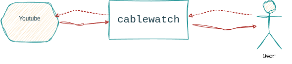
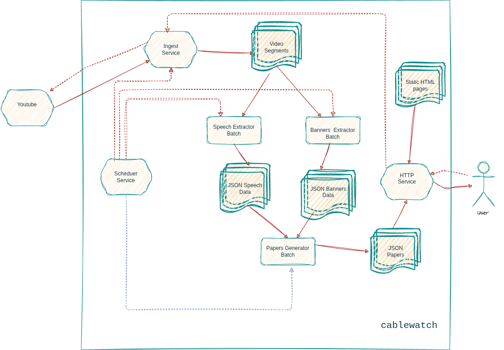
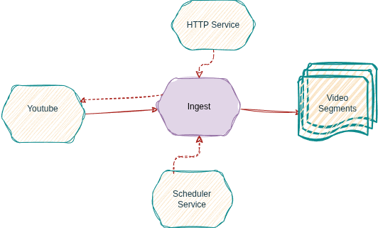
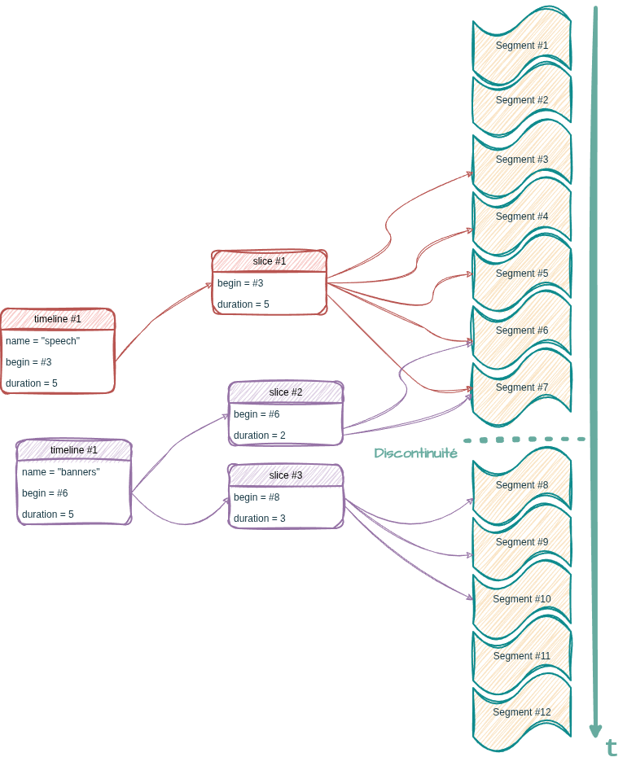
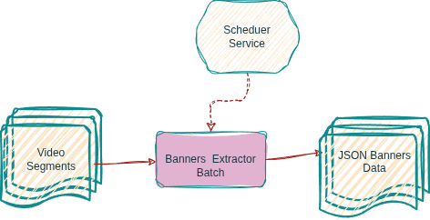
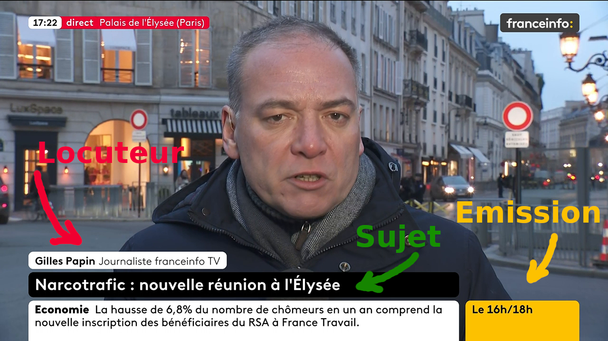
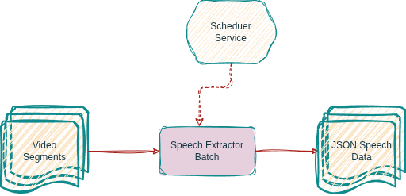
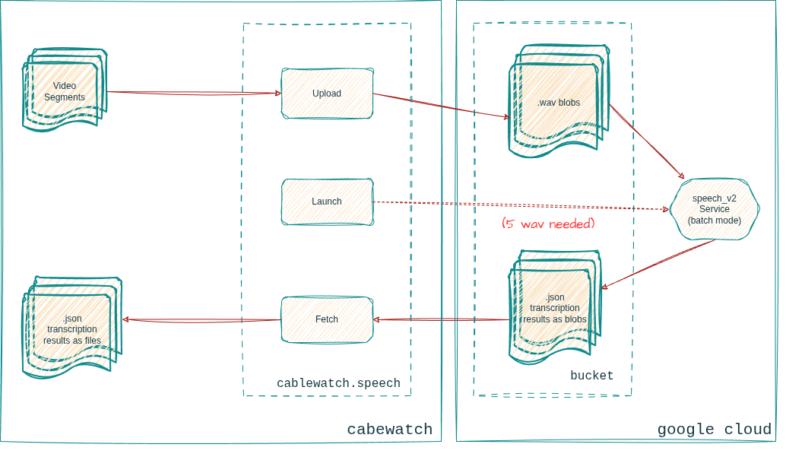
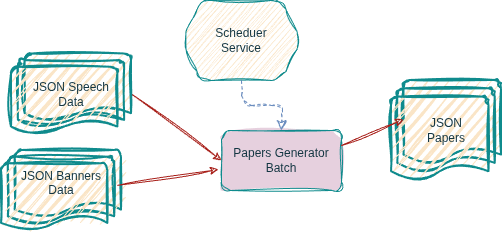
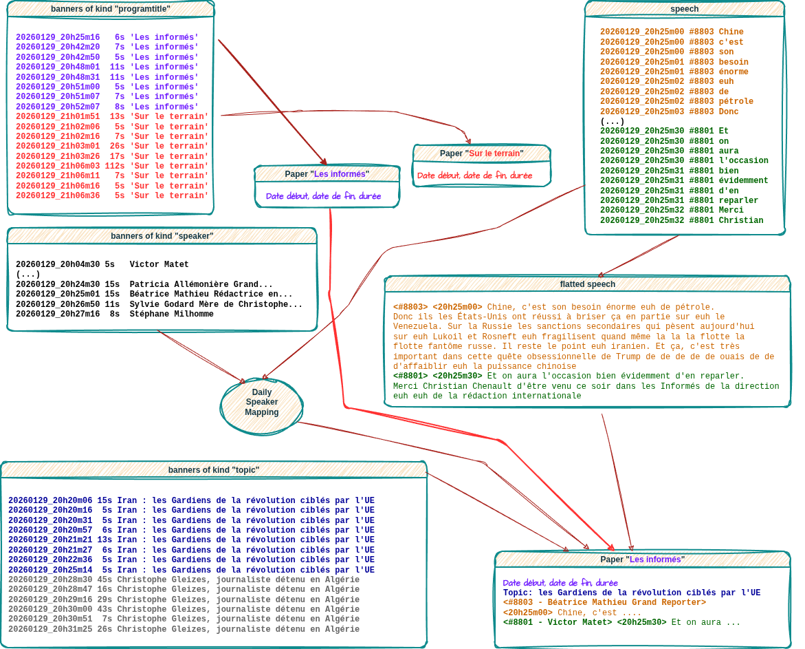

.. rubric:: ``cablewatch``
  :class: title-primary

.. rubric:: Base documentaire construite |br| à partir du *live* d'une chaîne d'info
  :class: title-secondary

.. rubric:: Sébastien MATZ |br| *2 Février 2026* |br| https://gitlab.com/loghaan/cablewatch.git
  :class: title-fields

|pgbr|

Introduction
============

.. include:: report.rst
  :start-after: table-overview
  :end-before: /table-overview

|pgbr|

Architecture
============

|pgbr|

``cablewatch.ingest`` (1)
=========================

- ``yt-dlp | ffmpeg``
- enregistrement sous forme de segments de ``30s``
- horodatage des segments
- *respawn*
    - coupure journalière du stream youtube
    - pas de réseau
    - autre problème…
- ajouter un marker en cas de trous (discontinuité)
- API Web interne pour arrêter / démarrer l’enregistrement 
    - utilisé par le *scheduler* pour ignorer les programmes de nuit
    - utilsé par la page de *monitoring* de l'ingest

|pgbr|

``cablewatch.ingest`` (2)
=========================

fournit une interface de programation pour |br| les autres modules
~~~~~~~~~~~~~~~~~~~~~~~~~~~~~~~~~~~~~~~~~~~~~~~~~~~~~~~~~~~~~~~~~~

- parcourir les vidéo enregistrées

- les objets *timeline* et *slice*
    - la *timeline* est une fenêtre temporelle de traitement

- lancer ``ffmpeg`` sur un *slice*

- permet de "voir" quels sont les segments
    - plus utlisé (taille d'un segment ~ 3-5M)
    - en cours d'utilisation
    - qui vont être utilisé

|pgbr|

``cablewatch.banners`` (1)
==========================

- Principe (Batch sur timeline)

  - ``ffmpeg``: Utilisation des filtres |br|
    ``freezedetect`` et ``crop`` |br|
    => *timestamp* + durée

  - ``ffmpeg``: au *timestamp* |br| on ``crop`` à nouveau
    => image

  - ``PIL``: vérifie la couleur du fond |br|
    => valide ou pas qu'on a |br| bien un bandeau

  - ``tesseract``: on donne l'image |br| à l'OCR
    => contenu textuel |br| du bandeau

|pgbr|

``cablewatch.banners`` (2)
==========================

On range dans une (pseudo) table dont voici le schéma:

.. include:: report.rst
  :start-after: banners-table
  :end-before: /banners-table

Interface de programmation pour les autres modules:

.. code-block:: python

    from datetime import datetime, timedelta
    from cablewatch.banners import BannersQuery
    begin = datetime.now() - timedelta(hours=24)
    end = datetime.now()
    for row in BannersQuery(begin=begin, end=end, layer="silver"):
        print(row)
        # {'kind': 'topic',         'begin': 20260130_07h00m14, 'duration': 4.866667,   'content': 'Narcotrafic : E. Macron lance le "plan douanes massif"'}
        # {'kind': 'programtitle',  'begin': 20260130_07h00m39, 'duration': 12.666667,  'content': 'La matinale'}
        # {'kind': 'speaker',       'begin': 20260129_20h27m29, 'duration': 3.5,        'content': 'Thibaut Bruttin Directeur de Reporters sans frontières'}

|pgbr|

``cablewatch.speech`` (1)
=========================

Objectif:

    - Batch sur timeline

    - Faire la transcription de l'audio

    - Utilise l'API ``speech_v2`` de google cloud

|pgbr|

``cablewatch.speech`` (2)
=========================

|pgbr|

``cablewatch.speech`` (3)
=========================

Point charnière une fois les résultats récupérés: *l'overlap*
~~~~~~~~~~~~~~~~~~~~~~~~~~~~~~~~~~~~~~~~~~~~~~~~~~~~~~~~~~~~~

.. include:: report.rst
  :start-after: speech-silver-sentence
  :end-before: /speech-silver-sentence

Sans *overlap*
--------------

.. include:: report.rst
  :start-after: speech-silver-no-overlap
  :end-before: /speech-silver-no-overlap

Avec *overlap*
--------------

.. include:: report.rst
  :start-after: speech-silver-overlap
  :end-before: /speech-silver-overlap

|pgbr|

``cablewatch.speech`` (4)
=========================

On range dans une (pseudo) table dont voici le schéma:

.. include:: report.rst
  :start-after: speech-table
  :end-before: /speech-table

Interface de programmation pour les autres modules:

.. code-block:: python
  :class: small-font

    from datetime import datetime, timedelta
    from cablewatch.speech import SpeechQuery

    begin = datetime.now() - timedelta(hours=24)
    end = datetime.now()

    for row in BannersQuery(begin=begin, end=end, layer="gold"):
        print(row)   #     {'timestamp': '20260130_06h29m34', 'speaker': 10317, 'word': 'cher'}

|pgbr|

``cablewatch.papers`` (1)
=========================

Finalité du projet
~~~~~~~~~~~~~~~~~~

  - Construire un document ou *paper* par émission

  - Format ``.json``

  - Aggréger les données provenant des bandeaux et de la transcription audio

  - Fournir à l'utilisateur un moyen d'accéder à ces *papers*
        - API web
        - page HTML satique

|pgbr|

``cablewatch.papers`` (2)
=========================

|pgbr|

``cablewatch.scheduler``
========================

Techno: utilisation d'une *library* python minimaliste pour le *scheduling*, ``apscheduler``

Planification
~~~~~~~~~~~~~

.. list-table::
  :header-rows: 1
  :class: scheduler-table

  * - Trigger
    - Action
  * - à ``06h25`` chaque jour
    - Démarrer enregistrement
  * - à ``00h05`` chaque jour
    - Arrêter enregistrement
  * - *quand l'enregistrement démarre*
    - Créer ou réinitialiser la *timeline* ``banners``
  * - *quand l'enregistrement démarre*
    - Créer ou réinitialiser la *timeline* ``speech``
  * - *toutes les minutes*
    - Extraire les bandeaux si possible depuis la *timeline* ``banners``
  * - *toutes les minutes*
    - *Uploader* l'audio vers le bucket GCP si possible  depuis la *timeline* ``banners``
  * - *toutes les minutes*
    - Démarrer si possible la transcription côté GCP
  * - *toutes les minutes*
    - Récupérer les résultats de transcription si disponible
  * - à ``02h00`` chaque jour
    - Générer les *papers* de la journée précédente ``[NOT_IMPLEMENTED]``
